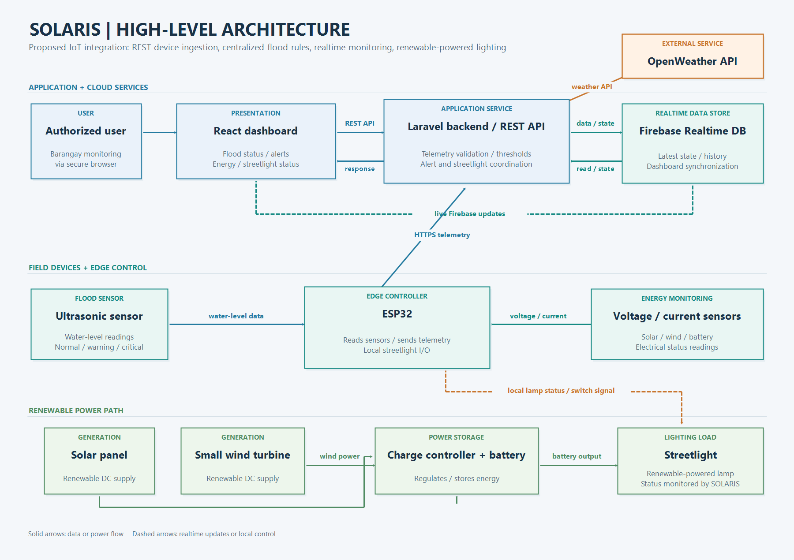

Project Overview
1. System Objectives
The SOLARIS project aims to develop an IoT-based flood monitoring system with a renewable energy powered streetlight. The system is designed to help monitor the water level and provide alerts when the water reaches warning or critical levels. It also monitors the solar and wind energy used to power the streetlight. The project aims to provide authorized users with clear and accessible information through a dashboard for easier monitoring and response.
2. Proposed Scope
The proposed system will integrate the following modules:
- Flood Monitoring Module – monitors the water level using an ultrasonic sensor and identifies warning and critical conditions.
- Alert and Notification Module – provides alerts when the water level reaches the defined warning or critical threshold.
- Renewable Energy Monitoring Module – monitors the solar and wind energy sources used for the streetlight.
- Streetlight Module – uses renewable energy to provide lighting and monitors its electrical output.
- Dashboard Module – displays flood status, water level, energy information, and system conditions for authorized users.
- Data Storage Module – stores monitoring data and historical records for viewing and reporting.
In-Scope Features
- Water-level monitoring
- Flood warning and critical status
- Flood alerts and notifications
- Solar energy monitoring
- Wind energy monitoring
- Battery monitoring
- Renewable-energy-powered streetlight monitoring
- Dashboard for system monitoring
- Storage of monitoring data and history
Out-of-Scope Features
The following features are not included in the initial scope:
- Automatic flood evacuation
- Automatic control of community emergency services
- Large-scale weather prediction
- Advanced artificial intelligence flood prediction
- Control of external government emergency systems
3. Stakeholders
Barangay Officials
Barangay officials are the primary users of the system. They need clear and updated information about the water level, flood status, alerts, and system condition to support monitoring and response.
Community Residents
Residents are indirect beneficiaries of the system because flood monitoring and warning information can help improve awareness of possible flood conditions in the community.
Project Team
The project team is responsible for designing, developing, integrating, testing, documenting, and presenting the SOLARIS system.
4. Tools & Technologies
Languages/Frameworks
- PHP
- Laravel
- JavaScript
- React
- HTML
- CSS
Hardware/IoT
- ESP32
- Ultrasonic water-level sensor
- Solar panel
- Small wind turbine
- Battery
- Solar charge controller
- Current and voltage sensors
Integration Approach
- Proposed hybrid integration pattern: REST API for device/backend requests and Firebase Realtime Database for real-time state distribution and persistence.
- IoT device-to-cloud communication from the ESP32 to the Laravel service.
- React dashboard for authorized users, with REST requests for service operations and live Firebase updates for monitoring data.
Repositories/Services
- GitHub – source code management and collaboration
- Firebase – real-time data storage
- OpenWeather API – weather information
Testing Tools
- Browser Developer Tools
- Postman
- Git/GitHub
- Manual system testing

## High-Level System Overview

### Integration Pattern & Rationale

SOLARIS uses a **hybrid IoT-to-cloud integration pattern**: the ESP32 sends sensor telemetry to the Laravel backend through a REST API, while Firebase Realtime Database stores the latest system state and monitoring records and distributes updates to the React dashboard. The Laravel backend applies flood thresholds, coordinates alerts and streetlight status, and acts as the trusted boundary between devices, data storage, external services, and users. OpenWeather data, when enabled, is retrieved by the backend through its API rather than directly by the device.

This pattern is proposed because REST provides a simple, interoperable request/response contract for device telemetry and backend operations, while Firebase's real-time synchronization supports a responsive dashboard without requiring frequent polling. Keeping threshold evaluation and integrations in the backend centralizes system rules and avoids giving field devices direct access to user-facing services or broad database permissions. The ESP32 remains responsible for local sensor interfacing and streetlight I/O, which keeps the field connection practical even when cloud services are temporarily unavailable; data delivery and alert freshness still depend on connectivity.

For deployment, expose the backend over HTTPS, authenticate and validate device requests, and restrict Firebase access so devices cannot write arbitrary records. These are recommended integration controls and should be configured as implementation work proceeds.

### Major Modules / Subsystems

1. **Flood Monitoring Module**
   - Monitors the water level using the flood sensor.
   - Detects if the water level is normal, warning, or critical.

2. **Renewable Energy Monitoring Module**
   - Monitors the solar and wind energy used by the system.
   - Provides information about the available renewable energy.

3. **Streetlight Management Module**
   - Manages the operation of the renewable energy powered streetlight.
   - Monitors the streetlight status and power condition.

4. **Alert and Dashboard Module**
   - Displays flood level, renewable energy data, and streetlight status.
   - Provides warning or critical alerts to authorized users.

### External Systems / Interfaces

- Flood Sensor
- Solar Energy Sensor
- Wind Energy Sensor
- Streetlight
- Web Dashboard
- Monitoring Database

### Data Flow Summary

The flood sensor sends water level data to the SOLARIS system, while the solar and wind energy sensors send renewable energy data. The system processes and stores the collected information in the monitoring database. The data is then displayed on the dashboard for authorized users.. If the water reaches a warning or critical level, the system generates an alert. The system also monitors and manages the operation of the renewable energy powered streetlight.